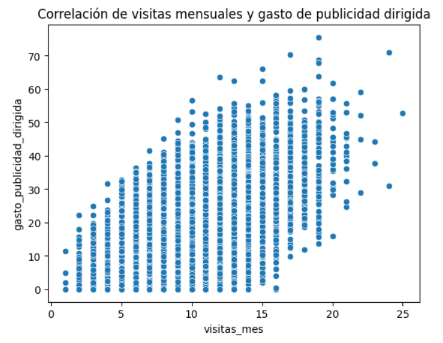
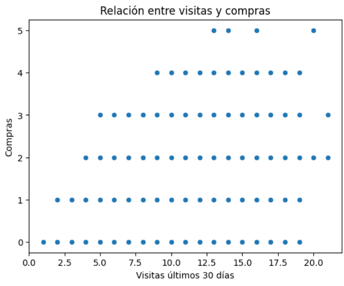
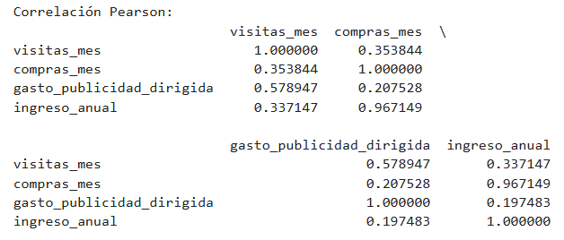
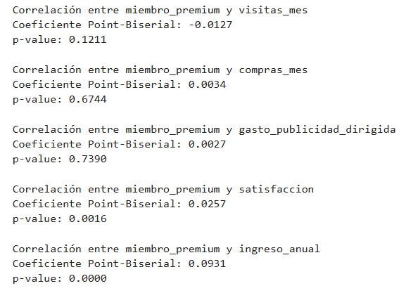
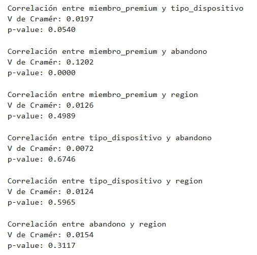

# Proyecto 7 - Explorando factores de comportamiento en NovaRetail+
NovaRetail+ es una plataforma de comercio electrónico en Latinoamérica con millones de usuarios.

Para el cierre de 2024, el equipo de Crecimiento y retención tiene como objetivo responder:

¿Qué factores del comportamiento del cliente están más fuertemente asociados con el ingreso anual generado?

Este proyecto es un análisis correlacional (exploratorio).
Correlación ≠ causalidad.

## Hallazgo 1 — Impacto de la publicidad en el tráfico y compras dentro de la plataforma

### Evidencia visual:

  

  

### Evidencia numérica:

  

### Interpretación

Se observa una correlación positiva moderada-alta (0.58) entre el gasto en publicidad dirigida y las visitas mensuales a la plataforma. Este resultado sugiere que la inversión en campañas publicitarias está siendo efectiva para atraer usuarios y generar navegación dentro de la plataforma de NovaRetail+.

Sin embargo, la relación entre gasto en publicidad dirigida e ingreso anual es débil (0.20), lo que indica que el aumento en visitas no se está traduciendo proporcionalmente en mayores ingresos. Esto podría sugerir que el tráfico generado por las campañas no se está convirtiendo en compras de manera eficiente.

Aunado a ello, el análisis muestra una correlación positiva moderada (0.35) entre visitas mensuales y compras mensuales. Esto indica que los usuarios que visitan con mayor frecuencia la plataforma tienden a realizar más compras, aunque la relación no es lo suficientemente fuerte como para afirmar que todas las visitas se convierten en transacciones.

### Implicación de negocio

Sería recomendable revisar la segmentación de las campañas publicitarias, analizando con mayor detalle el mercado objetivo y los productos promocionados, con el fin de mejorar la conversión y maximizar el retorno de la inversión (ROI)

Adicionalmete, para incrementar el número de compras a partir del tráfico existente, sería conveniente optimizar distintos aspectos del proceso de interacción del cliente, tales como:

-Mejorar la satisfacción del cliente en cada etapa del embudo de conversión.

-Optimizar la orientación de las campañas publicitarias, alineándolas con mercados y productos específicos.

-Fortalecer estrategias de fidelización, que incentiven a los usuarios a completar el proceso de compra.

## Hallazgo 2 — Impacto del programa premium en el comportamiento del cliente

### Evidencia numérica:

  

### Interpretación

El análisis sugiere que, aunque el programa premium parece aportar cierto valor en términos de satisfacción del cliente, su impacto sobre variables clave del comportamiento del usuario, como la frecuencia de compra y la interacción con la plataforma, es limitado.

Este resultado indica que, si bien la membresía premium podría estar contribuyendo a mejorar la percepción del servicio, no está generando cambios significativos en el patrón de consumo de los clientes.

### Implicación de negocio

Sería recomendable reforzar las estrategias de fidelización, así como optimizar la inversión en campañas publicitarias, con el objetivo de incentivar una mayor participación de los usuarios y mejorar la conversión dentro de la plataforma.

## Hallazgo 3 — Relación entre membresía premium y abandono

### Evidencia numérica:

  

### Interpretación

El análisis muestra una asociación positiva pero débil (V de Cramér = 0.1202) entre miembro premium y abandono. Este resultado sugiere que el estado de membresía podría estar relacionado con diferencias en el comportamiento de permanencia de los clientes dentro de la plataforma.

### Implicación de negocio

En línea con los hallazgos previos, esto podría indicar que el programa premium está contribuyendo a reducir el abandono, funcionando potencialmente como una herramienta de fidelización dentro de NovaRetail+. Por lo tanto, fortalecer y optimizar los beneficios asociados a esta membresía podría ser una estrategia relevante para mejorar la retención de clientes en la plataforma.

## Limitaciones

### 1. El análisis se basa en correlaciones

Estas métricas permiten identificar relaciones o asociaciones entre variables, pero no permiten establecer causalidad.

### 2. Falta de variables explicativas adicionales

El dataset analizado contiene variables relevantes como visitas, compras, satisfacción y publicidad; sin embargo, pueden faltar factores importantes que influyen en el comportamiento del cliente, por ejemplo: tipo de producto comprado, precios o descuentos, tiempo de permanencia en la plataforma, experiencia de usuario, historial de compras más detallado, etc. La ausencia de estas variables limita la capacidad de explicar completamente los patrones observados.

### 3. Relaciones estadísticamente significativas pero débiles

Algunas relaciones encontradas son estadísticamente significativas pero con coeficientes bajos, lo que indica que el efecto real sobre el comportamiento del cliente es pequeño.

### 4. Posible colinealidad entre variables de negocio

Se identificó una correlación extremadamente alta entre compras mensuales e ingreso anual (0.97), lo que sugiere colinealidad.

### 5. No se evaluó directamente la tasa de conversión del embudo

Aunque se analizaron visitas, compras y publicidad, no se realizó un análisis completo del funnel de conversión. Esto limita la capacidad de identificar en qué etapa del proceso se están perdiendo los clientes.

